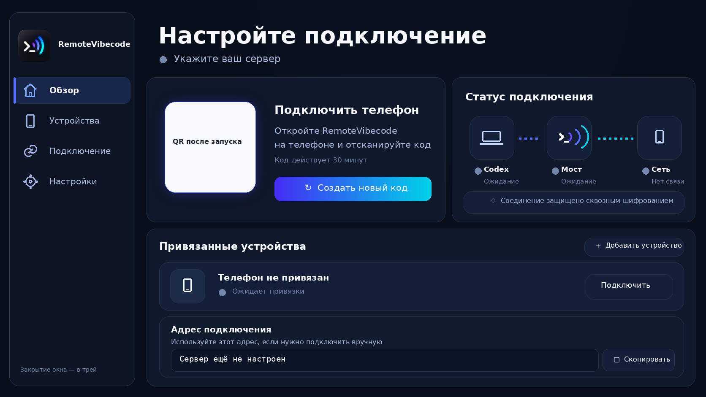
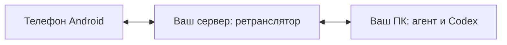

# RemoteVibecode

**Codex на вашем ПК — с Android-телефона.** Чаты, проекты, файлы, изображения и ход выполнения задач в одном приложении.

[Скачать](https://github.com/wilmain-arch/RemoteVibecode/releases/latest) · [Установить](docs/GETTING_STARTED.md) · [Обновить](docs/UPDATING.md) · [Решить проблему](docs/TROUBLESHOOTING.md) · [Сообщить об ошибке](https://github.com/wilmain-arch/RemoteVibecode/issues/new/choose)

## Интерфейс агента

Окно отрисовано интерфейсом приложения; показано состояние до подключения.

## Как это работает

Агент подключается к серверу сам: входящие порты на роутере ПК не нужны. Если сервер расположен дома, его порты должны быть доступны телефону через вашу сеть или настроенный маршрут. Для связи через публичный интернет серверу нужен доступный адрес и TCP-порты 8765–8767. Tailscale не обязателен.

В аккаунт Codex вы входите на ПК. Телефон привязывается по QR-коду агента, затем открывает чаты без повторного ввода кода. Ретранслятор передаёт зашифрованный трафик между телефоном и ПК.

## Скачать

Все файлы находятся в [последнем релизе](https://github.com/wilmain-arch/RemoteVibecode/releases/latest). Для запуска нужны телефон, ПК и собственный сервер.

| Где установить | Файл | Инструкция |
| --- | --- | --- |
| Android 8.0 и новее | `RemoteVibecode-*.apk` | [Телефон](android/README.md) |
| Windows x64 | `RemoteVibecodeAgent.exe` | [ПК Windows](agent/README.md) |
| Arch Linux | `remotevibecode-agent-*.pkg.tar.zst` | [ПК Arch](arch/README.md) |
| Сервер Debian 13 / Ubuntu 26.04 | `remotevibecode-relay_*_all.deb` | [Сервер](relay/README.md) |

### Состав опубликованного комплекта

[Комплект 0.4.2](https://github.com/wilmain-arch/RemoteVibecode/releases/tag/bundle-v0.4.2): Android **0.10.0**, агент ПК **0.2.2**, ретранслятор **0.1.1**. Разные номера обозначают отдельные компоненты, а не разные каналы обновления.

## Первый запуск

1. Установите ретранслятор на сервере. Получите его секрет и отпечаток сертификата.
2. Войдите в Codex Desktop на ПК. Запустите агент и укажите данные сервера.
3. Установите APK и отсканируйте QR-код агента.

[Пошаговая инструкция и требования →](docs/GETTING_STARTED.md)

## Возможности

- Чаты и проекты: создание, переключение, удаление и распределение чатов.
- Ход выполнения, модель и усилие; очередь сообщений и корректировка текущей задачи.
- Передача файлов, просмотр папок проекта, изображения в чате и скачивание.
- Светлая, тёмная и системная темы; копирование текста.
- Лимиты 5ч/неделя, расход за время задачи и сброс через доступные кредиты аккаунта.
- Управление подключениями ADB при включённой отладке телефона.

## Статус и совместимость

Предварительная версия. Реальная работа проверялась на Arch Linux с Codex Desktop 26.928.31416 (встроенный app-server 0.159.2) и OnePlus 9 Pro. Windows EXE собирается в CI; полный маршрут на физическом Windows-ПК не проверен. Пакет сервера предназначен для Debian 13 и Ubuntu 26.04; сборка пакета не заменяет проверку установки на каждой системе.

Один ретранслятор обслуживает один агент ПК, мост — один привязанный телефон. Остальные дистрибутивы Linux и macOS не имеют готовых пакетов. Codex CLI поддерживается как резервный источник; модели и возможности могут отличаться от Desktop. Совпадение всех функций Desktop не заявляется.

Расход лимитов измеряется по всему аккаунту и может включать параллельные чаты. Для старых задач без замера данные не восстанавливаются. Сброс доступен только при наличии кредитов аккаунта.

## Помощь и разработка

[Диагностика](docs/TROUBLESHOOTING.md) · [Участие в разработке](CONTRIBUTING.md) · [Сборка и выпуск](docs/BUILDING.md) · [Документы разработки](docs/development/README.md)

## Лицензия

[MIT](LICENSE). Лицензии включённых сторонних компонентов сохраняются отдельно, например [Lucide](third_party/lucide/LICENSE).
